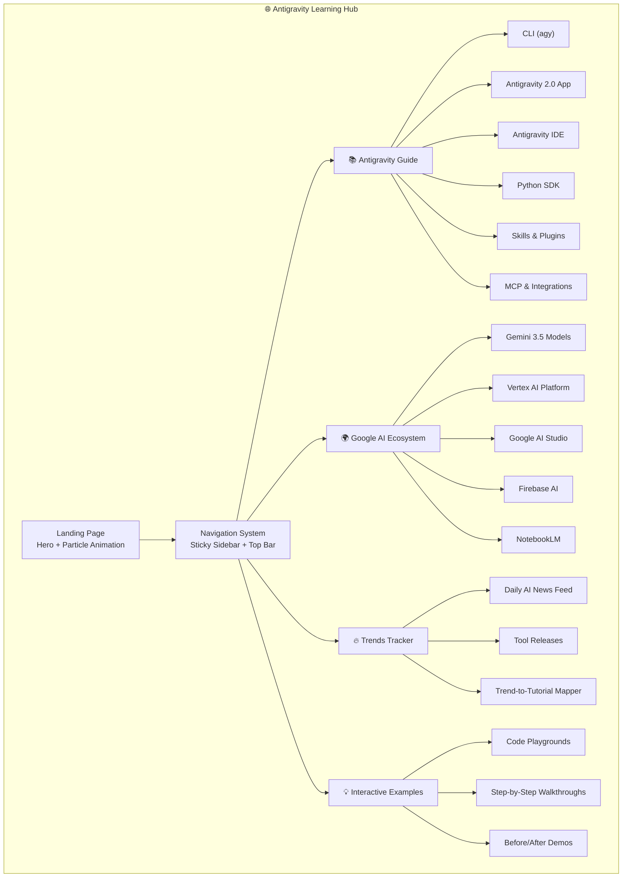

# 🚀 Antigravity & Google AI Ecosystem — Interactive Learning Hub

A premium, animation-rich web application that serves as the definitive guide to Google Antigravity and the broader Google AI ecosystem, featuring interactive tutorials, smart examples, and a real-time AI trends tracker.

---

## Decisions Made

| Question | Decision |
|----------|----------|
| **Tech Stack** | Vite + Vanilla JS + GSAP — zero framework overhead, max performance |
| **Deployment** | **Vercel** (primary) — free tier, instant deploys, global CDN, custom domain support |
| **Trends Data** | Curated JSON file (Phase 1) → API-driven feeds (Phase 2) |
| **Branding** | Futuristic dark-mode palette — deep purples, electric blues, neon accents |

> [!WARNING]
> **Scope**: This is a substantial single-page application with ~15+ sections. The initial build will focus on a fully functional, beautifully animated MVP. Advanced features (user accounts, progress tracking, AI-powered search) can be added in Phase 2.

---

## Application Architecture



---

## Proposed Changes

### 📁 Project Structure

```
antigravity-hub/
├── index.html                    # Main entry point
├── style.css                     # Global design system + all styles
├── js/
│   ├── app.js                    # Main application controller & router
│   ├── animations.js             # GSAP animation orchestrator
│   ├── components/
│   │   ├── navbar.js             # Top navigation + mobile menu
│   │   ├── sidebar.js            # Collapsible sidebar navigation
│   │   ├── hero.js               # Landing hero with particle system
│   │   ├── feature-card.js       # Reusable feature card component
│   │   ├── code-block.js         # Syntax-highlighted code examples
│   │   ├── tutorial-stepper.js   # Step-by-step tutorial component
│   │   ├── trends-feed.js        # Trends news feed component
│   │   ├── search-bar.js         # Global fuzzy search
│   │   ├── ecosystem-map.js      # Interactive ecosystem visualization
│   │   └── toast.js              # Notification toasts
│   └── data/
│       ├── antigravity-guide.js  # All Antigravity feature data
│       ├── ecosystem-data.js     # Google AI ecosystem data
│       ├── tutorials.js          # Interactive tutorial definitions
│       └── trends.js             # Curated trends data (updated regularly)
├── assets/
│   ├── icons/                    # SVG icons for features
│   └── images/                   # Generated images for sections
└── favicon.svg                   # App favicon
```

---

### Component 1: Foundation — Design System & Layout

#### [NEW] `index.html`
The main HTML shell with:
- SEO-optimized `<head>` with meta tags, Open Graph, and structured data
- Google Fonts (Inter + JetBrains Mono for code)
- GSAP CDN import
- Semantic HTML5 layout: `<header>`, `<nav>`, `<main>`, `<aside>`, `<footer>`
- Particle canvas for hero background
- Section containers for all major content areas

#### [NEW] `style.css`
A comprehensive design system featuring:
- **CSS Custom Properties**: Full token system (colors, spacing, typography, shadows, borders)
- **Color Palette**: Deep space dark mode — `#0a0a1a` base, electric blue `#4f8ff7`, neon purple `#a855f7`, cyan accent `#06b6d4`, warm amber `#f59e0b`
- **Glassmorphism Components**: Cards with `backdrop-filter: blur()`, semi-transparent borders, subtle gradients
- **Animated Gradients**: Mesh gradient backgrounds that shift subtly
- **Typography Scale**: Fluid typography using `clamp()` for responsive sizing
- **Micro-animations**: Hover states, focus rings, card lifts, shimmer effects
- **Responsive Grid**: CSS Grid + Flexbox layouts for all screen sizes
- **Scrollbar Styling**: Custom themed scrollbars
- **Code Block Themes**: Dark syntax-highlighted code blocks with copy buttons

---

### Component 2: Hero & Landing Experience

#### [NEW] `js/components/hero.js`
A cinematic landing section with:
- **Animated Particle System**: Canvas-based floating particles connecting with lines (constellation effect)
- **Typewriter Title**: "Master Google Antigravity & the AI Ecosystem" typed character by character
- **Glowing CTA Buttons**: "Start Learning" and "Explore Trends" with pulse animations
- **Scroll-triggered Reveal**: Content sections fade/slide in as user scrolls
- **Stats Counter**: Animated counters showing "4 Surfaces | 40+ Skills | 7 Plugins | Real-time Trends"
- **Feature Showcase Carousel**: Auto-rotating cards highlighting key sections

---

### Component 3: Antigravity Complete Guide

#### [NEW] `js/data/antigravity-guide.js`
Comprehensive data covering ALL Antigravity features organized into sections:

**Section 1 — Antigravity CLI (`agy`)**
- TUI layout & navigation (Chat Panel, Auxiliary Pane, Prompt Bar)
- All keyboard shortcuts (50+ keybindings documented)
- Slash commands (`/goal`, `/schedule`, `/browser`, `/learn`, `/grill-me`, `/teamwork-preview`)
- Settings configuration (`settings.json` keys)
- Smart examples: Creating a project, debugging with CLI, background task management

**Section 2 — Antigravity 2.0 Desktop App**
- Left sidebar navigation (History, Artifacts, Files Changed, Terminals)
- Chat canvas with markdown rendering
- HTML Auxiliary Pane (Subagents, Background Tasks, Artifacts tabs)
- Multi-agent workflows
- Smart examples: Spawning subagents, managing artifacts, parallel execution

**Section 3 — Antigravity IDE**
- VS Code-based AI-first IDE
- Sidebar chat panels
- Inline code lenses (accept/reject AI suggestions)
- Smart examples: Code refactoring with AI, inline completions, workspace-aware suggestions

**Section 4 — Antigravity Python SDK**
- Agent leasing & orchestration APIs
- Custom tool exposure
- Programmatic agent control
- Smart examples: Building custom agents, exposing tools, orchestration scripts

**Section 5 — Skills & Plugins**
- Skill structure (SKILL.md, scripts/, examples/, resources/)
- Plugin architecture (plugin.json, skills/, agents/)
- 40+ science skills (AlphaFold, PubMed, PubChem, UniProt, etc.)
- Smart examples: Creating a custom skill, installing plugins, skill auto-discovery

**Section 6 — Customizations & Advanced**
- Rules (AGENTS.md global & workspace)
- MCP (Model Context Protocol) integrations
- Sidecars & Hooks
- Browser automation & testing
- Agent permissions & security

#### [NEW] `js/components/feature-card.js`
Reusable animated cards for each feature:
- Glassmorphism card with icon, title, description
- Hover: Card lifts with shadow, icon pulses, gradient border appears
- Click: Expands into full tutorial view with slide-down animation
- Tags showing difficulty level (Beginner / Intermediate / Advanced)
- "Try it" button linking to relevant code playground

#### [NEW] `js/components/tutorial-stepper.js`
Interactive step-by-step tutorial component:
- Vertical timeline with numbered steps
- Each step has: instruction text, code example, expected output
- Animated progress indicator
- "Copy to clipboard" for all code blocks
- Completion confetti animation on finishing a tutorial

---

### Component 4: Google AI Ecosystem Map

#### [NEW] `js/data/ecosystem-data.js`
Data for the broader Google AI ecosystem:

| Product | Category | Description |
|---------|----------|-------------|
| Gemini 3.5 Flash | Core Model | High-speed reasoning for agentic workflows |
| Gemini Omni | Core Model | Multimodal text/audio/image/video |
| Gemini Spark | AI Agent | Autonomous personal AI agent |
| Vertex AI | Enterprise | Managed agents API, data cloud |
| Google AI Studio | Dev Tool | Prompt prototyping & API management |
| Firebase AI | Backend | AI-powered app development |
| NotebookLM | Research | AI research & audio overviews |
| CodeMender | Security | AI vulnerability remediation |
| WebMCP | Infrastructure | Agent-ready web UIs |
| Android AI | Mobile | On-device AI for Android/Pixel |

#### [NEW] `js/components/ecosystem-map.js`
Interactive ecosystem visualization:
- **Orbital Diagram**: Central "Google AI" node with products orbiting in concentric rings
- **Hover Effects**: Hovering a node highlights its connections and shows a detail card
- **Click Navigation**: Clicking a product scrolls to its dedicated section
- **Animated Connections**: Pulsing lines showing relationships between products
- **Category Color Coding**: Different rings for Models, Tools, Platforms, Infrastructure

---

### Component 5: AI Trends Tracker

#### [NEW] `js/data/trends.js`
Curated trends data structure:
```javascript
{
  trends: [
    {
      id: "trend-001",
      title: "MCP Protocol Goes Mainstream",
      date: "2026-06-28",
      category: "protocol",
      source: "Agentic AI Foundation",
      summary: "MCP adopted by all major AI providers...",
      impact: "high",
      relatedTutorial: "mcp-integration",
      tags: ["MCP", "integrations", "standards"]
    },
    // ... 20+ curated trends
  ]
}
```

#### [NEW] `js/components/trends-feed.js`
Dynamic trends feed with:
- **Masonry Grid Layout**: Cards of varying heights for visual interest
- **Filter Chips**: Filter by category (Models, Tools, Protocols, Frameworks, Security)
- **Impact Badges**: High/Medium/Low impact indicators with color coding
- **"Learn This in Antigravity"** button: Links trends to relevant tutorials
- **Date Grouping**: "Today", "This Week", "This Month" sections
- **Auto-scroll Animation**: New trend cards slide in from the right
- **Trend-to-Tutorial Mapper**: Each trend card shows which Antigravity feature is relevant

Curated trend categories:
1. **Agentic AI Workflows** — Multi-agent orchestration, autonomous coding
2. **MCP & Protocols** — Tool integrations, standardization
3. **New Models** — Gemini updates, frontier model releases
4. **Developer Tools** — IDE updates, CLI tools, SDK releases
5. **Enterprise AI** — Vertex AI, deployment, security
6. **Science & Research** — Bio/Chem AI tools, AlphaFold updates

---

### Component 6: Navigation & Search

#### [NEW] `js/components/navbar.js`
Top navigation bar:
- Frosted glass effect with blur
- Logo + app name with gradient text
- Section quick-links with active state indicator
- Dark/light mode toggle (animated sun/moon icon)
- Mobile hamburger menu with slide-in drawer

#### [NEW] `js/components/sidebar.js`
Collapsible sidebar (desktop):
- Tree-view navigation mirroring content structure
- Active section highlighting with animated indicator bar
- Collapse/expand with smooth transitions
- Search shortcut hint
- Progress indicators per section

#### [NEW] `js/components/search-bar.js`
Global search with:
- Command palette style (`Ctrl+K` to open)
- Fuzzy search across all features, tutorials, and trends
- Keyboard navigation of results
- Categorized results (Features, Tutorials, Trends, Ecosystem)
- Recent searches memory

---

### Component 7: Interactive Examples Engine

#### [NEW] `js/components/code-block.js`
Enhanced code display:
- Syntax highlighting (custom CSS-based for JS, Python, Bash, JSON)
- Line numbers with highlighting
- Copy-to-clipboard button with checkmark animation
- Language label badge
- Collapsible long code blocks
- Diff view for before/after comparisons

#### [NEW] `js/data/tutorials.js`
20+ interactive tutorials including:

| # | Tutorial | Surface | Level |
|---|----------|---------|-------|
| 1 | Your First `agy` Session | CLI | Beginner |
| 2 | Spawning Subagents | App 2.0 | Intermediate |
| 3 | Building a Custom Skill | Skills | Advanced |
| 4 | MCP Server Integration | MCP | Advanced |
| 5 | Browser Automation Testing | Browser | Intermediate |
| 6 | Creating Rules & Customizations | Config | Beginner |
| 7 | Using the Python SDK | SDK | Intermediate |
| 8 | Background Task Management | CLI/App | Intermediate |
| 9 | Science Skills Deep Dive | Plugins | Advanced |
| 10 | Deploying with Firebase AI | Ecosystem | Intermediate |
| 11 | Keyboard Shortcuts Mastery | CLI | Beginner |
| 12 | Agent Permissions & Security | Security | Advanced |
| 13 | Slash Commands Power Guide | CLI/App | Beginner |
| 14 | Artifact Creation Workflow | App 2.0 | Intermediate |
| 15 | Multi-Agent Orchestration | App 2.0 | Advanced |

---

### Component 8: Animations Orchestrator

#### [NEW] `js/animations.js`
Central animation controller using GSAP:

1. **Page Load Sequence**: Staggered fade-in of nav → hero → content sections
2. **Scroll Animations**: `ScrollTrigger` for reveal animations on every section
3. **Particle System**: Canvas-based floating particles with mouse interaction
4. **Card Hover Effects**: 3D tilt on hover using CSS transforms
5. **Section Transitions**: Smooth scroll-snapping between major sections
6. **Counter Animations**: Number counting up animations for stats
7. **Typewriter Effect**: Character-by-character text reveal for headings
8. **Gradient Mesh**: Animated background gradients that shift over time
9. **Progress Bar**: Reading progress indicator in the top bar
10. **Micro-interactions**: Button ripples, toggle switches, checkbox ticks

---

### Component 9: Core Application Controller

#### [NEW] `js/app.js`
Main application entry point:
- Client-side hash-based routing (`#guide`, `#ecosystem`, `#trends`, `#tutorials`)
- Dynamic section loading and rendering
- State management for active section, search, filters
- Event delegation for all interactive elements
- Lazy loading of heavy sections
- Local storage for user preferences (dark mode, last viewed section)
- Keyboard shortcut handler
- Mobile responsive adaptations

---

## Visual Design Direction

### Color System
| Token | Value | Usage |
|-------|-------|-------|
| `--bg-primary` | `#0a0a1a` | Main background |
| `--bg-secondary` | `#111128` | Card backgrounds |
| `--bg-glass` | `rgba(17,17,40,0.7)` | Glassmorphism panels |
| `--accent-blue` | `#4f8ff7` | Primary actions, links |
| `--accent-purple` | `#a855f7` | Secondary highlights |
| `--accent-cyan` | `#06b6d4` | Code, terminal elements |
| `--accent-amber` | `#f59e0b` | Warnings, trending badges |
| `--accent-green` | `#22c55e` | Success, beginner level |
| `--text-primary` | `#f1f5f9` | Main text |
| `--text-secondary` | `#94a3b8` | Muted text |
| `--gradient-hero` | `linear-gradient(135deg, #4f8ff7, #a855f7, #06b6d4)` | Hero accents |

### Typography
- **Headings**: Inter (700/800 weight) with gradient text effects
- **Body**: Inter (400 weight, 1.6 line-height)
- **Code**: JetBrains Mono (400 weight) with ligatures
- **Sizes**: Fluid `clamp()` from mobile to desktop

### Key Visual Effects
1. **Glassmorphism Cards**: `backdrop-filter: blur(20px)` + border gradients
2. **Mesh Gradient Backgrounds**: Multi-stop radial gradients that animate
3. **Neon Glow Effects**: `box-shadow` with color spread on hover
4. **Dot Grid Pattern**: Subtle repeating dot pattern on backgrounds
5. **Gradient Text**: `background-clip: text` on headings
6. **Floating Elements**: Subtle `translateY` animations on decorative elements

---

## Deployment & CI/CD Strategy

### Primary: Vercel (Recommended ✅)

Vercel is ideal for this Vite-based static app — zero-config, free tier, global edge network, instant deploys.

#### Setup Steps
1. **Push to GitHub**: Initialize a Git repo and push the project
2. **Connect Vercel**: Link the GitHub repo at [vercel.com/new](https://vercel.com/new)
3. **Auto-detected Config**: Vite is auto-detected — no manual configuration needed
4. **Every push to `main`** triggers a production deploy
5. **Every PR** gets a unique preview URL for testing

#### Vercel Configuration

```json
// vercel.json (root of project)
{
  "buildCommand": "npm run build",
  "outputDirectory": "dist",
  "framework": "vite",
  "rewrites": [
    { "source": "/(.*)", "destination": "/index.html" }
  ],
  "headers": [
    {
      "source": "/assets/(.*)",
      "headers": [
        { "key": "Cache-Control", "value": "public, max-age=31536000, immutable" }
      ]
    }
  ]
}
```

#### Custom Domain (Optional)
1. Go to Vercel Dashboard → Project → Settings → Domains
2. Add your domain (e.g., `antigravity-hub.yourdomain.com`)
3. Update DNS: Add CNAME record pointing to `cname.vercel-dns.com`
4. SSL is auto-provisioned

### Fallback Options

| Platform | Setup | Free Tier | Notes |
|----------|-------|-----------|-------|
| **Netlify** | Drag-drop `dist/` folder or connect GitHub | ✅ 100GB bandwidth/mo | Add `_redirects` file: `/* /index.html 200` |
| **Firebase Hosting** | `firebase init hosting` → `firebase deploy` | ✅ 10GB storage, 360MB/day | Best if you want Firebase backend later |
| **Google Cloud Run** | Dockerize + deploy | ✅ Free tier | Overkill for static site, but scales infinitely |
| **GitHub Pages** | Push to `gh-pages` branch | ✅ Unlimited | No SPA routing support without workarounds |

### CI/CD Pipeline (GitHub Actions)

```yaml
# .github/workflows/deploy.yml
name: Deploy to Vercel
on:
  push:
    branches: [main]
  pull_request:
    branches: [main]

jobs:
  build-and-preview:
    runs-on: ubuntu-latest
    steps:
      - uses: actions/checkout@v4
      - uses: actions/setup-node@v4
        with:
          node-version: 20
          cache: 'npm'
      - run: npm ci
      - run: npm run build
      - name: Deploy to Vercel
        uses: amondnet/vercel-action@v25
        with:
          vercel-token: ${{ secrets.VERCEL_TOKEN }}
          vercel-org-id: ${{ secrets.VERCEL_ORG_ID }}
          vercel-project-id: ${{ secrets.VERCEL_PROJECT_ID }}
          working-directory: ./
```

### Updated Project Structure (with deployment files)

```
antigravity-hub/
├── .github/
│   └── workflows/
│       └── deploy.yml            # CI/CD pipeline
├── public/
│   └── favicon.svg               # Static assets
├── index.html                    # Main entry point
├── style.css                     # Global design system
├── js/                           # Application code
│   ├── app.js
│   ├── animations.js
│   ├── components/
│   └── data/
├── assets/                       # Images & icons
├── vercel.json                   # Vercel config
├── package.json                  # Dependencies & scripts
├── vite.config.js                # Vite configuration
├── .gitignore                    # Git ignore rules
└── README.md                     # Project documentation
```

---

## Implementation Phases

### Phase 1 — MVP + Deploy (This Build) ✅
- [ ] Project setup with Vite + Git init
- [ ] Complete design system (style.css)
- [ ] Hero with particle animation
- [ ] Navigation (navbar + sidebar)
- [ ] Antigravity Guide (all 6 sections with feature cards)
- [ ] Google AI Ecosystem map
- [ ] Interactive tutorials (15 tutorials with code examples)
- [ ] Trends tracker with curated data
- [ ] Global search
- [ ] Full responsive design
- [ ] All GSAP animations
- [ ] Vercel deployment config (`vercel.json`)
- [ ] GitHub Actions CI/CD pipeline
- [ ] **Deploy to Vercel** → live URL accessible 24/7

### Phase 2 — Enhancements (Future)
- [ ] API-driven trends (RSS feeds, Hacker News API, etc.)
- [ ] User progress tracking with localStorage
- [ ] Dark/Light mode toggle
- [ ] PDF export of tutorials
- [ ] AI-powered search with semantic matching
- [ ] Community contributions section
- [ ] Changelog auto-sync from antigravity.google
- [ ] Custom domain setup
- [ ] Analytics integration (Google Analytics / Plausible)

---

## Verification Plan

### Automated Tests
- Verify all HTML/CSS/JS files are syntactically correct
- Test responsive design at 320px, 768px, 1024px, 1440px breakpoints
- Validate all internal links and navigation routes
- `npm run build` succeeds with zero errors

### Deployment Verification
- Run `npm run build` locally and verify `dist/` output
- Test the production build with `npm run preview`
- Deploy to Vercel and verify the live URL loads correctly
- Test all routes work with client-side routing (SPA rewrites)
- Verify assets are served with correct cache headers
- Lighthouse audit on deployed URL (target: 90+ Performance, 100 Accessibility)

### Manual Verification
- Launch dev server and visually inspect all sections
- Test all animations (scroll, hover, click interactions)
- Verify mobile responsiveness on the live URL
- Test keyboard navigation and search functionality
- Screenshot key sections for walkthrough documentation

---

## Estimated File Count & Complexity
| Component | Files | Lines (est.) |
|-----------|-------|-------------|
| HTML | 1 | ~300 |
| CSS | 1 | ~1200 |
| JS Core | 3 | ~800 |
| JS Components | 10 | ~2000 |
| JS Data | 4 | ~1500 |
| Config (Vite, Vercel, CI/CD) | 4 | ~100 |
| Assets | 5+ | — |
| **Total** | **~28** | **~5900** |
